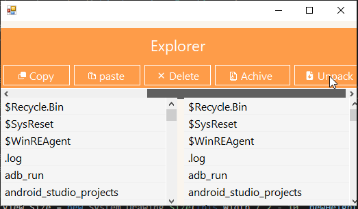

Простой файловый проводник на C# с использованием Windows Forms
===============================================================

[Отчет о проделанной работе](https://github.com/dEN5-tech/simple-explorer-wf/raw/main/otch.odt)

Этот проект представляет собой простое приложение файлового проводника, разработанное на языке C# с использованием технологии Windows Forms. Проект предоставляет базовый интерфейс для просмотра содержимого директорий, а также навигации между ними.

Описание проекта
----------------

### Основные характеристики

*   **Иконки:** Весь проект использует FontAwesome для отображения иконок для папок, файлов и действий.
    
*   **Навигация:** Пользователь может переходить между директориями, просматривать их содержимое и возвращаться назад.
    
*   **Выбор директории:** Пользователь может выбирать директории с помощью стандартного диалога выбора папки.
    
*   **Отображение содержимого:** Содержимое каждой директории отображается в списке, где папки представлены иконками папок, а файлы - иконками файлов.
    
*   **Навигационная панель:** На верхней части окна расположена навигационная панель, предоставляющая кнопки для перехода на домашнюю директорию, предыдущую директорию и выбора новой директории.
    
*   **Изменение размеров:** Пользователь может изменять размеры окна, и список файлов автоматически подстраивается под новые размеры.
    

### Дополнительные возможности

*   **Иконки в списке:** Каждый элемент списка содержит иконку и название папки или файла для лучшего визуального представления.
    
*   **Локализация:** Названия кнопок на навигационной панели поддерживают локализацию для различных языков.
    
*   **Обработка ошибок:** Проект включает обработку и вывод сообщений об ошибках при возникновении проблем при работе с файловой системой.
    
*   **Стилизация интерфейса:** Интерфейс приложения стилизован с использованием цветов и шрифтов для лучшего визуального восприятия.
    

Использование
-------------

1.  **Загрузка:** Загрузите проект в среду разработки, такую как Visual Studio.
    
2.  **Зависимости:** Убедитесь, что у вас установлены все необходимые зависимости, включая FontAwesome.
